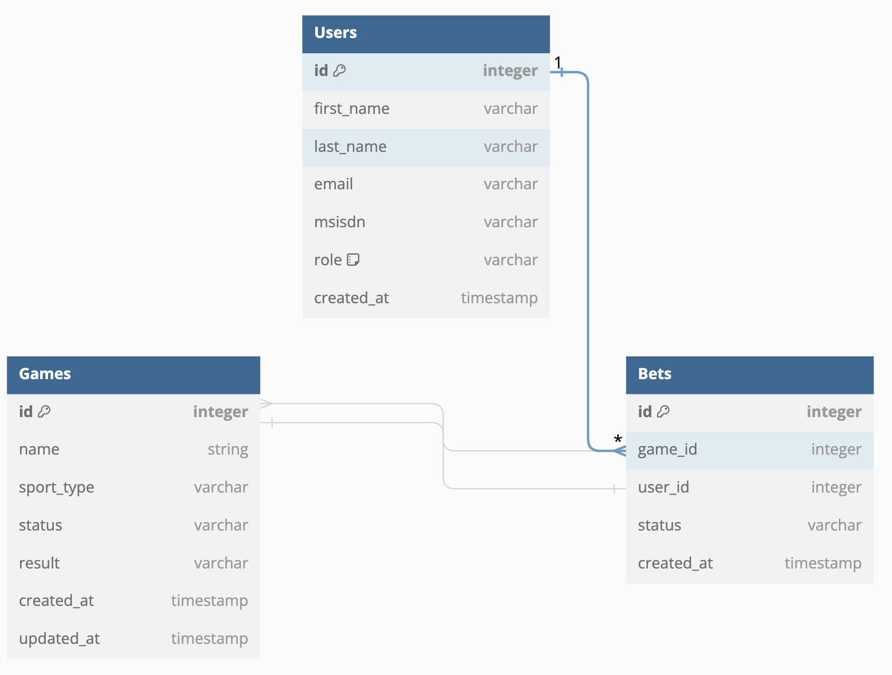

# Betting System

## Folder Structure

- `assets`: Contains asset files for the app - JS, CSS & Images.
- `lib`: Contains source code files for the application logic.
- `priv`: Contains private application files (e.g., assets, templates).
- `test`: Contains test files for the application.

## Installation

To set up and run this application, you need to follow these steps:

1. Clone the repository: `git clone https:/github.com/ericgitangu/elixir-phoenix-betting-system`
2. Install dependencies: `mix deps.get`
3. Create and migrate the database: `mix ecto.setup`
4. Start the Phoenix server: `mix phx.server`

## Usage

To use the application, follow these steps:

1. Access the application at `http:/localhost:4000`
2. Sign up or log in with Github to start viewing and participating in wagering BettingSystem

## Overview

Creating an architectural document and detailed implementation plan for a betting system using Elixir and Phoenix involves several steps. This document outlines the architecture, components, and implementation details of the system.

### System Overview

The betting system will be a dynamic, scalable web application built using the Phoenix framework, which leverages the Elixir programming language. The system will support multiple sports, with an initial focus on football, and provide functionalities for user management, bet management, game management, and administrative tasks.

### System Components

1. **Web Interface**: A responsive and user-friendly interface for both frontend users and administrators.
2. **Elixir/Phoenix Backend**: The core logic of the application, handling requests, business logic, data management, and notifications.
3. **Database**: PostgreSQL for data storage, including user data, BettingSystem, games, and transaction histories.
4. **Authentication and Authorization**: For secure access control using Phoenix's built-in libraries or external libraries like Guardian.
5. **Email Service**: For sending notifications to users about bet outcomes, using an email library compatible with Elixir, such as Bamboo.

### Functional Requirements

1. **User Management**: Registration, authentication, profile management, and account management.
2. **Bet Management**: Placing, viewing, and canceling BettingSystem.
3. **Game Management**: Adding, updating, and managing sports games, initially limited to football but expandable to other types.
4. **Transaction History**: Viewing a history of BettingSystem, including winnings and losses.
5. **Administrative Functions**: User management, bet oversight, soft deletion of users and data, and profit tracking.
6. **Superuser Privileges**: Configuring games, managing user roles, and sending email notifications.

### Implementation Details

#### Database Schema

- `Users`: Stores user information, including `first_name`, `last_name`, `email_address`, `msisdn`, and role.
- `Games`: Contains game details, with a dynamic structure to accommodate different sports types.
- `BettingSystem`: Records details of BettingSystem placed by users, including the associated game, bet amount, and status.
- `Transactions`: Logs all betting transactions, including wins and losses.

#### Elixir/Phoenix Modules

1. **User Module**: Handles user registration, authentication, profile updates, and role management.
2. **Game Module**: Manages game records, including creation, updates, and listing available games.
3. **Bet Module**: Manages bet lifecycle, including placing, updating, and canceling BettingSystem, as well as calculating outcomes.
4. **Admin Module**: Provides administrative functionalities, including user management, bet oversight, and financial reporting.
5. **Notification Module**: Manages sending email notifications to users regarding bet outcomes.

#### Security

- Implement secure authentication and session management.
- Ensure proper role-based access control for different user types.

#### Testing

- **Unit Tests**: Write Elixir doctests and ExUnit tests for individual functions to ensure reliability and correctness. Also to test out edge cases.

### Development and Deployment

- Use Mix for project management and dependencies.
- Employ continuous integration (CI) practices with tool -GitHub.
- Deploy the application to a production environment - Fly.io.

### Maintenance and Scalability

- Monitor system performance and optimize queries and processes for efficiency - dev/platform.
- Use Phoenix's built-in support for WebSockets for real-time features, if necessary.
- Normalize DBs effectively to support effecient querying.

## Database Schema Migrations

Below are the migration files needed to create the necessary tables in your PostgreSQL database:

## Users Table

```sh
defmodule BettingSystem.Repo.Migrations.CreateUsers do
  use Ecto.Migration

  def change do
    create table(:users) do
      add :first_name, :string
      add :last_name, :string
      add :email_address, :string, unique: true
      add :msisdn, :string, unique: true
      add :role, :string, default: "user"

      timestamps()
    end

    create index(:users, [:email_address])
  end
end
```

## Games Table

```sh
defmodule BettingSystem.Repo.Migrations.CreateGames do
  use Ecto.Migration

  def change do
    create table(:games) do
      add :name, :string
      add :sport_type, :string
      add :status, :string, default: "upcoming" # Possible values: upcoming, live, completed
      add :result, :string

      timestamps()
    end
  end
end
```

## BettingSystem Table

```sh
defmodule BettingSystem.Repo.Migrations.CreateBettingSystem do
  use Ecto.Migration

  def change do
    create table(:BettingSystem) do
      add :amount, :decimal
      add :status, :string, default: "pending" # Possible values: pending, won, lost
      add :user_id, references(:users)
      add :game_id, references(:games)

      timestamps()
    end

    create index(:BettingSystem, [:user_id])
    create index(:BettingSystem, [:game_id])
  end
end
```

## User Schema

```sh
defmodule BettingSystem.Accounts.User do
  use Ecto.Schema
  import Ecto.Changeset

  schema "users" do
    field :first_name, :string
    field :last_name, :string
    field :email_address, :string
    field :msisdn, :string
    field :role, :string

    timestamps()
  end

  @doc false
  def changeset(user, attrs) do
    user
    |> cast(attrs, [:first_name, :last_name, :email_address, :msisdn, :role])
    |> validate_required([:first_name, :last_name, :email_address, :msisdn])
  end
end
```

## User Creation

```sh
defmodule BettingSystem.Accounts do
  alias BettingSystem.Accounts.User
  alias BettingSystem.Repo

  def create_user(attrs) do
    %User{}
    |> User.changeset(attrs)
    |> Repo.insert()
  end
end
```

## Authentication

Using Ueberauth for authentication with Gmail and GitHub, first add Ueberauth and the specific strategies to your mix.exs dependencies

```sh
defp deps do
  [
    {:ueberauth, "~> 0.6"},
    {:ueberauth_github, "~> 0.8"},
    {:ueberauth_google, "~> 0.10"}
  ]
end
```

## Authentication configs

```sh
config :ueberauth, Ueberauth,
  providers: [
    github: {Ueberauth.Strategy.Github, []},
    google: {Ueberauth.Strategy.Google, []}
  ]

config :ueberauth, Ueberauth.Strategy.Github.OAuth,
  client_id: System.get_env("GITHUB_CLIENT_ID"),
  client_secret: System.get_env("GITHUB_CLIENT_SECRET")

config :ueberauth, Ueberauth.Strategy.Google.OAuth,
  client_id: System.get_env("GOOGLE_CLIENT_ID"),
  client_secret: System.get_env("GOOGLE_CLIENT_SECRET"),
  redirect_uri: System.get_env("GOOGLE_REDIRECT_URI")
```

## Unit-Test Strategy (Red/Green)

Next, we'll write ExUnit tests for the create_user function in the BettingSystem.Accounts module. These tests will verify that the function behaves as expected when given valid and invalid input.

## Example - Test for Successfull User Creation

```sh
defmodule BettingSystem.AccountsTest do
  use BettingSystem.DataCase

  alias BettingSystem.Accounts
  alias BettingSystem.Accounts.User

  describe "create_user/1" do
    test "creates a user with valid data" do
      attrs = %{first_name: "Jane", last_name: "Doe", email_address: "jane@example.com", msisdn: "1234567890"}
      {:ok, user} = Accounts.create_user(attrs)

      assert user.first_name == "Jane"
      assert user.last_name == "Doe"
      assert user.email_address == "jane@example.com"
      assert user.msisdn == "1234567890"
    end
  end
end
```

## Example - Test for User Creation with Invalid Data

```sh
describe "create_user/1 with invalid data" do
  test "fails to create a user with missing data" do
    attrs = %{first_name: "Jane"} # Missing required fields
    assert {:error, changeset} = Accounts.create_user(attrs)

    assert changeset.valid? == false
    assert Enum.any?(changeset.errors, fn {field, _} -> field == :last_name end)
    assert Enum.any?(changeset.errors, fn {field, _} -> field == :email_address end)
  end
end
```

## Entity Relational Diagram



## User Schema specific roles

First, ensure your user schema includes a field to store the user's role. You might have a role field that can store values such as "user", "admin", or "superuser".

```sh
defmodule BettingSystem.Accounts.User do
  use Ecto.Schema
  import Ecto.Changeset

  schema "users" do
    field :first_name, :string
    field :last_name, :string
    field :email_address, :string
    field :msisdn, :string
    field :role, :string, default: "user" # Assuming 'user', 'admin', 'superuser'

    timestamps()
  end

  def changeset(user, attrs) do
    user
    |> cast(attrs, [:first_name, :last_name, :email_address, :msisdn, :role])
    |> validate_required([:first_name, :last_name, :email_address, :msisdn, :role])
  end
end
```

## Role Management

In your accounts context (or wherever you manage user-related logic), implement functions to grant or revoke admin roles. Ensure that only superusers can execute these functions.

```sh
defmodule BettingSystem.Accounts do
  alias BettingSystem.Accounts.User
  alias BettingSystem.Repo

  <!-- Function to grant admin role -->
  def grant_admin_role(superuser_id, target_user_id) do
    with {:ok, superuser} <- get_superuser(superuser_id),
         {:ok, target_user} <- get_user(target_user_id) do
      target_user
      |> User.changeset(%{role: "admin"})
      |> Repo.update()
    else
      _error -> {:error, :unauthorized}
    end
  end

  <!--  Function to revoke admin role -->
  def revoke_admin_role(superuser_id, target_user_id) do
    with {:ok, superuser} <- get_superuser(superuser_id),
         {:ok, target_user} <- get_user(target_user_id) do
      target_user
      |> User.changeset(%{role: "user"})
      |> Repo.update()
    else
      _error -> {:error, :unauthorized}
    end
  end

   <!-- Helper function to fetch a superuser -->
  defp get_superuser(id) do
    case Repo.get(User, id) do
      %User{role: "superuser"} = user -> {:ok, user}
      _ -> {:error, :not_found}
    end
  end

  <!-- # Helper function to fetch any user -->
  defp get_user(id) do
    case Repo.get(User, id) do
      nil -> {:error, :not_found}
      user -> {:ok, user}
    end
  end
end
```

## Protecting Role Mangement Functions

Ensure that role management functions can only be executed by superusers. This can be done at the controller level by checking the current user's role before allowing them to call grant_admin_role/2 or revoke_admin_role/2. You might use a plug or a controller callback to perform this check.

```sh
defmodule BettingSystemWeb.UserController do
  use BettingSystemWeb, :controller

  plug :authorize_superuser when action in [:grant_admin, :revoke_admin]

  def grant_admin(conn, %{"target_user_id" => target_user_id}) do
    current_user = conn.assigns.current_user
    case BettingSystem.Accounts.grant_admin_role(current_user.id, target_user_id) do
      {:ok, _user} -> 
        conn
        |> put_flash(:info, "Admin role granted successfully.")
        |> redirect(to: Routes.user_path(conn, :index))
      {:error, _reason} -> 
        conn
        |> put_flash(:error, "Unauthorized.")
        |> redirect(to: Routes.page_path(conn, :index))
    end
  end

  def revoke_admin(conn, %{"target_user_id" => target_user_id}) do
    current_user = conn.assigns.current_user
    case BettingSystem.Accounts.revoke_admin_role(current_user.id, target_user_id) do
      {:ok, _user} -> 
        conn
        |> put_flash(:info, "Admin role revoked successfully.")
        |> redirect(to: Routes.user_path(conn, :index))
      {:error, _reason} -> 
        conn
        |> put_flash(:error, "Unauthorized.")
        |> redirect(to: Routes.page_path(conn, :index))
    end
  end
  ```

## Plug to check if the current user is a super

  ```sh
  plug :authorize_superuser when action in [:grant_admin, :revoke_admin]

  defp authorize_superuser(conn, _opts) do
    current_user = conn.assigns[:current_user]

    if current_user && current_user.role == "superuser" do
      conn
    else
      conn
      |> put_flash(:error, "You must be a superuser to perform this action.")
      |> redirect(to: Routes.page_path(conn, :index))
      |> halt()
    end
  end
  ```
